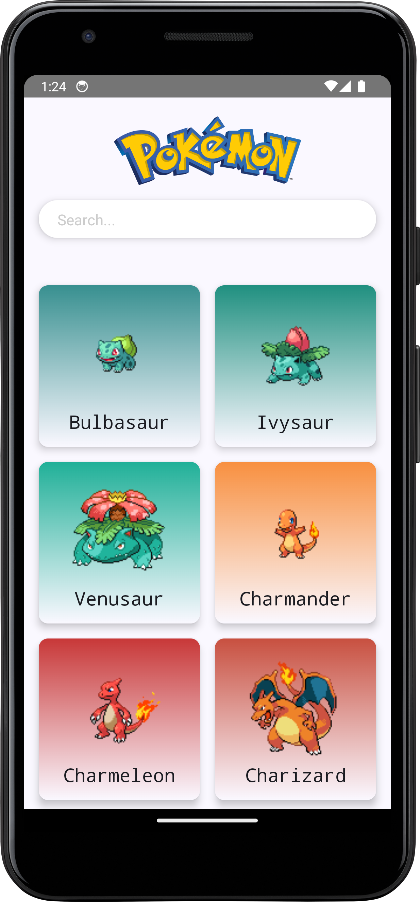
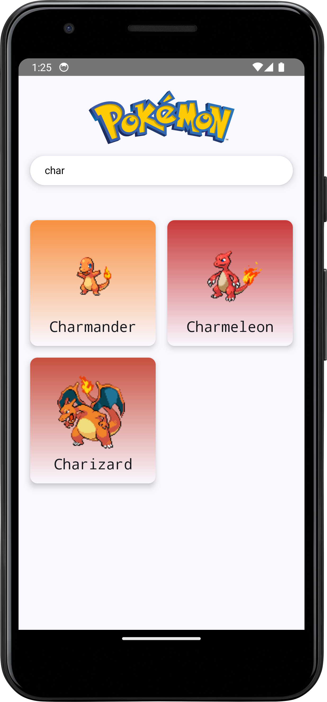
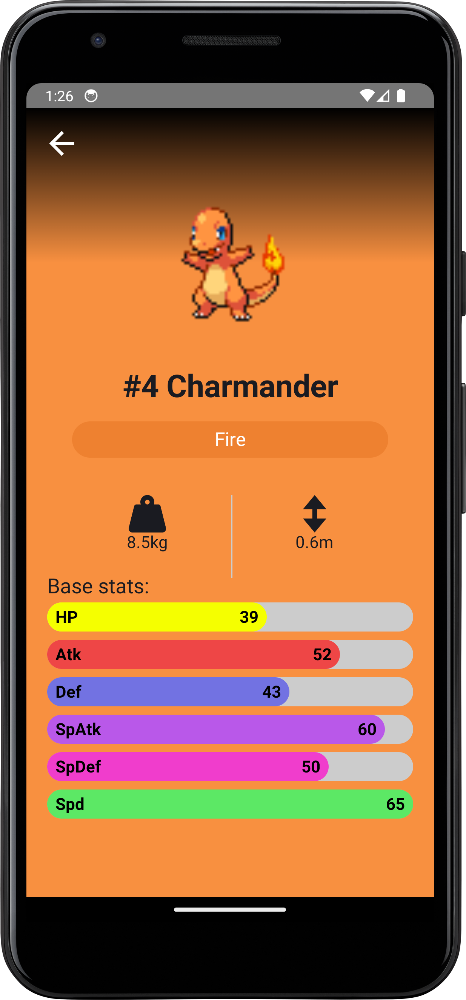

# Pokémon Android App


An Android app built with **Kotlin** and **Jetpack Compose**, allowing users to browse and explore Pokémon with detailed stats, abilities, and evolutions.

---

## 📸 Screenshots
  

---

## 🚀 Features
✔️ View details of any Pokémon  
✔️ Search Pokémon  
✔️ Supports dark & light mode  
✔️ Modern **Jetpack Compose** UI  
✔️ Uses **PokéAPI** for real-time data  

---

## 🛠 Tech Stack
- **Kotlin, Jetpack Compose**
- **MVVM Architecture**
- **Retrofit** (API calls)
- **Coroutines** (async programming)
- **CoilCompose** (image loading)
- **DaggerHilt** (Dependency Injection)
- **Timber** (logging)

---

API Reference: https://pokeapi.co/api/v2/pokemon

---

🤝 Credits & Acknowledgments
This project is inspired by and follows tutorials from Philipp Lackner.
Special thanks for his amazing content on Jetpack Compose & Android Development! 

---

📬 Contact

GitHub: https://github.com/Jamie10X 

Email: jamshidboynazarov0@gmail.com

---
Feel free to clone , fetch and add changes to the project.

## 📦 Installation
1. Clone the repo:
   ```sh
   git clone https://github.com/Jamie10X/PokemonApp.git
   cd PokedexHiltVersion
